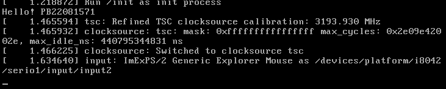

# Lab1

## Linux内核编译

### 过程记录

1. 直接编译

   时间：3 min 42 s

   大小：12.9MiB

2. 先对`Gerenal setup`进行修改，删除`Automatically append information to the version string`，`POSIX Message Queues`，`Enable process_vm_readv/writev syscalls`。

   时间：3 min 42 s

   大小：12.8MiB

   可见删除的这些选项对编译的时间和内核大小影响均很小

3. 因为本次实验与网络无关，故删除`Networking support`

   时间：2 min 36 s

   大小：9.1MiB

   可见这个选项切实影响了编译的的时间和内核大小

4. 因为前面删除了一整个选项影响很大，所以再尝试删除`Enable locatable module support`

   时间：2 min 31 s

   大小：8.9MiB

   可见这个选项也是对时间和大小有一定影响，但是影响不大

5. 再对`Processor type and features`进行修改，删除了`Symmetric multi-processing support`，`Machine check/overheating report`，`AMD MCE features`，`Old style AMD opteron NUMA detection`，`ACPI NUMA detection`，`Linux guest support`

   时间：2 min 22 s

   大小：8.4MiB

6. 在`General setup`又做了进一步修改：在`Kernel compression mode`中选择了`This compression algorithm's ratio is best.`的`LAMA`，在`Compiler optimization level`中选择了`Optimize for size`选项。

   时间：2 min 21 s

   大小：5.8MiB！

   显然这两个选项对内核大小有显著影响，但对编译时间没有什么影响

7. 删除`kernel hacking`中的选项，这个名字翻译过来是内核黑客，感觉本次实验应该用不上，其中删除的`debug`选项应该也不需要

   时间：2 min 15s

   大小：5.3MiB

   可见这些选项对于内核大小有切实影响，对编译时间影响不大

8. 再在`Gerenal setup`中修改，在`support initial ramdisks/ramfs compressed for ...`中只保留了对`gzip`，`LAMA`，`XZ`的支持，删除了`timers subsystem`中的选项和`profiling support`，再在`Processor type and features`做修改，删除了`check low memory corruption`

   时间：2 min 02 s

   大小：5.2MiB

   可见这些选项对内核大小影响较小，但对编译时间影响较大

9. 删除了`Device Drivers`中的所有课删除的选项

   时间：1 min 21 s

   大小：3.1MiB！

### 总结分析：

对内核大小有显著影响的有`Networking support`，`Kernel compression mode`，`Compiler optimization level`，`Device Drivers`。`kernel hacking`对内核大小也有较大影响。

对编译时间有显著影响的有`Networking support`和`Device Drivers`。


## 创建初始内存盘

### 实验过程

按照教程一步一步来即可

### 原因分析

`init` 将会作为第一个用户态进程被启动，成为所有后续进程的父进程。因此需要`init.c`一直运行下去，如果没有`while(1)`循环，那么init.c很快就会执行完，后续进程就找不到父进程，内存盘就会陷入`kernel panic`。

### 实验结果

实验结果如图：




## 添加自定义系统调用

这个实验也是按照教程一步一步来即可

测试的文件为：

```c
#include <stdio.h>
#include <unistd.h>
#include <sys/syscall.h>

void syscall_test(int pid, char *buf, int buf_len)
{
        short res = syscall(pid, buf, buf_len);
        if(res == -1)
        {
                //printf("Succeed! The content is %s\n",buf);
                printf("Failed! The len %d is too short\n", buf_len);
        }
        else
        {
                //printf("Failed! The len %d is too short\n",buf_len);
                printf("Success! The content is %s\n",buf);
        }

}

int main() {
    //printf("Hello! PB22081571\n"); // Your Student ID
    char buf20[20], buf50[50];
    syscall_test(548,buf20,20);
    syscall_test(548,buf50,50);
    while(1) {}
}
```

最终测试就是按照第二个实验的流程再执行一遍即可。

输出结果如下：


