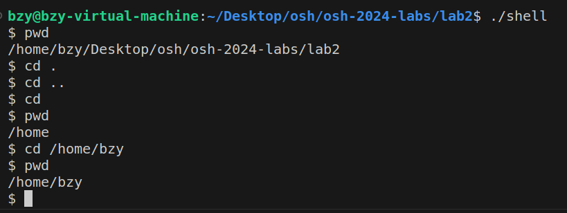
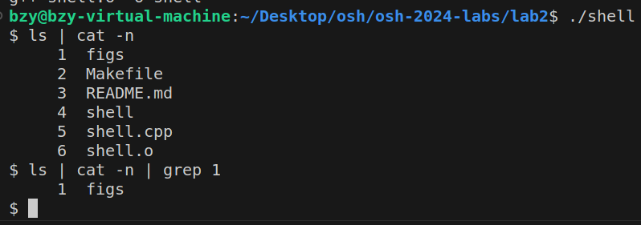
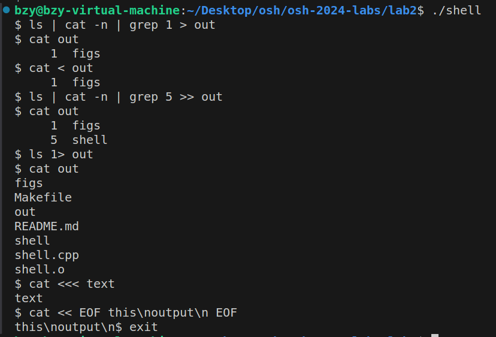
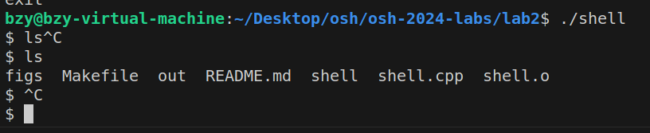
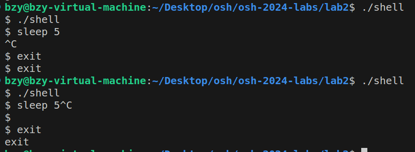
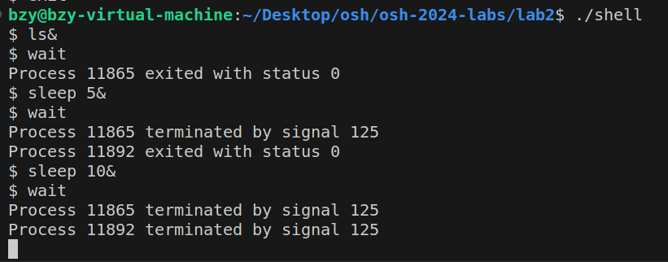
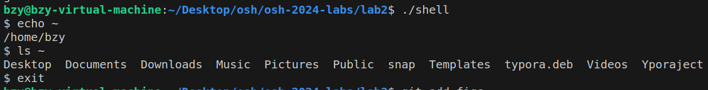

# Lab2

## 目录导航

**选做：** `cd` 在没有第二个参数时，默认进入家目录

运行方式与实验文档相同，下面是一个示例：

## 管道

运行方式与实验文档相同，下面是一个示例：

## 重定向

**选做：**支持数字文件描述符，支持文本重定向，支持`EOF`重定向

注：我实现的`EOF`重定向功能并不完整，只能支持一行输入，如果在`EOF`重定向中点击了`Enter`想要输入换行符，这个命令就会停止读取，但是可以通过输入`\n`来向文件中写入`\n`。原因是这个shell读取命令是一行一行读取的，如果想要实现允许换行的`EOF`重定向就需要修改命令读取方式，感觉很麻烦。

运行方式与实验文档相同，下面是一个示例：

## 信号处理

没有嵌套时运行方式与实验文档相同，下面是一个示例：

但是shell嵌套时运行却有问题：如果我在执行一条指令时键入`Ctrl`+`C`，可以正常终止内部shell程序，但是如果命令输入一半键入`Ctrl`+`C`，这时也会正确终止内部的shell程序，但是会连续打印出两个`$`。这个问题我还不知道该如何修改。具体情况如下图：

## 前后台进程

运行方式与实验文档相同，不同的是输出——为了凸显出后台进程的运行，我在使用wait命令时打印出了后台进程的情况，下面是一个示例：

其中最后一个`sleep 10&`的命令我截取了还没运行完的情况，此时还没有打印出下一个`$`。

## 其他可选

1. 实现了对`Ctrl+D`的处理。

2. 实现了对`~`的转换，会将`~`转换为家目录，下面是一个示例：

   

