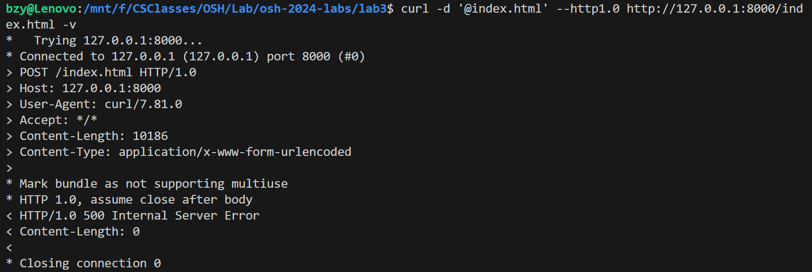

# Lab 3

## 编译运行方法

本次实验我实现的选做部分有**线程池机制和select函数实现的I/O复用**。

在`./lab3/src`目录下，使用`make`或`make all`命令，生成线程池机制实现的`server`，使用`make io`命令，生成使用`select`函数实现的`server_select`。即：

```makefile
make 		# 或make all，生成server
./server 	# 运行server
make io		# 生成server_select
./server_select	# 运行server_select
```

## 整体设计及使用技术

### 请求的处理方式

具体表现为以下几个函数：

```c
void divide_request(char *req, ssize_t req_len, char *method,char *url,char *version,char *host);
int parse_request(char* request, ssize_t req_len, char* path, ssize_t* path_len, char *version);
int get_content(char *path, long *file_size, FILE **file);
int write_response(char *response, int ret, int ret_2, long file_size, int clnt_sock);
void handle_clnt(int clnt_sock);
```

`divide_request`函数用于从`request`中读取请求的方法（`method`），URL（`url`），协议版本（`version`）和Host请求行（`host`）。

`parse_request`函数用于解析请求，返回0时表示请求成功，返回-1时表示其他错误，包括请求方法不是`GET`，URL不以`/`开头，请求的资源路径是一个目录，访问路径跳出当前路径，请求的协议版本不是`HTTP/1.0`或`HTTP/1.1`（所以我实现的服务器只支持这两个协议版本）,Host请求行不完整（不以`Host: `开头或不以`\r\n`结尾）等等。

`get_content`用于获得请求资源的大小和文件指针，返回0时表示成功，返回-2时表示请求的文件不存在，返回-1时表示其他错误，如请求资源的路径是一个目录或无法打开文件等。

`write_response`函数用于向`response`中写入返回头的内容（请求文件的内容不在这个函数中写入）。

`handle_clnt`函数用于处理请求。

### 请求行的读取与返回行的写入

因为不能假定一次性可以读取完（写入）请求行（返回行）的全部内容，所以采用分块读取/写入的方式。读取时以读取到`\r\n\r\n`为结束表示，写入时以写入内容的长度等于`response_len`为标志。

需要注意的是，`POST`请求时`request`中含有请求文件的内容，所以不能以`\r\n\r\n`作为结束标志，这时只能在读取的循环体中判断方法是否为`POST`，若是则立即进行相应的处理并跳出循环。我的处理方式如下：

```c
// 读取请求
    while (1) {
        // ...... 此处代码省略
        if(strlen(req_buf) >= 3 && strncmp(req_buf, "GET", 3) != 0) {
            write_response(response, -1, -1, 0, clnt_sock);
            goto end;
        }
        // ......此处代码省略
    }
```

其中`end`处的代码用于关闭客户端套接字（select版本的需要，线程池版本的不需要，因为在`thread_func`函数中会关闭），释放前面存储请求缓冲区的内存。

### 多线程技术

我使用了线程池机制，线程池结构体的定义如下：

```c
#define THREAD_POOL_SIZE 100
#define QUEUE_SIZE 40960
// 线程池结构体
typedef struct thread_pool {
    pthread_t threads[THREAD_POOL_SIZE]; // 线程数组
    int queue[QUEUE_SIZE]; // 任务队列，具体实现时采用循环队列的方式
    int head; // 任务队列的头部
    int tail; // 任务队列的尾部
    int clnt_socks[MAX_CONN]; // 存储客户端套接字的数组
    int clnt_cnt; // 连接的客户端数量
    sem_t sem_queue; // 任务队列的信号量
    pthread_mutex_t mutex_queue; // 互斥锁，用于保护任务队列的并发访问
    pthread_cond_t queue_not_full; // 条件变量，用于判断任务队列是否已满
    pthread_cond_t queue_not_empty; // 条件变量，用于判断任务队列是否为空
    int shutdown; // 表示线程池是否关闭
} thread_pool_t;
```

在`main`函数中首先创建一个线程池，初始化各个条件变量和信号量，任务队列及客户端数组初始化为空。在无限循环中，接受客户端的连接请求，并将新的客户端套接字添加到任务队列中。如果任务队列已满，等待队列非满条件。最后，发送一个信号量，表示任务队列中有新的任务可用。

此外定义了一个`thread_func()`函数用于处理任务，它在一个无限循环中执行以下操作：

首先，通过 `sem_wait`等待任务队列中有任务可用。然后，锁定任务队列（通过 `pthread_mutex_lock`），从队列中取出一个任务（即一个客户端套接字），并更新队列头部的位置。如果队列未满，会发送一个信号（通过 `pthread_cond_signal`）以唤醒可能正在等待队列非满条件的线程。然后，解锁任务队列（通过 `pthread_mutex_unlock`）。如果线程池正在关闭（`pool.shutdown == 1`），会跳出循环。最后，调用 `handle_clnt`函数并关闭客户端套接字。

### IO复用

我使用了`select`函数来实现这一功能，具体实现如下：

在`main`函数中首先初始化两个文件描述符集合：`reads` 和 `temps`。`reads` 集合中包含服务器套接字，而 `temps` 集合在每次循环开始时都被设置为 `reads` 集合的副本。用`fd_max` 表示当前最大的文件描述符。

在无限循环中，每次循环都会调用 `select` 函数，等待任何一个文件描述符准备好进行读取。如果 `select` 函数返回 -1，表示出错，打印错误信息并跳出循环。

在 `select` 函数返回后，遍历所有的文件描述符。如果某个文件描述符在 `temps` 集合中，表示该文件描述符准备好进行读取。如果该文件描述符是服务器套接字，表示有新的客户端连接请求，接受这个请求，并将新的客户端套接字添加到 `reads` 集合中。如果新的客户端套接字大于 `fd_max`，更新 `fd_max`。如果该文件描述符不是服务器套接字，表示有客户端发送了数据，调用`handle_clnt`函数处理这个客户端的数据，然后从 `reads` 集合中移除该客户端套接字，并关闭它。

## 测试结果

### 正确性测试

正常情况：


请求方法不为GET（即为POST）：



请求的资源路径是目录：


请求的文件不存在：


访问路径跳出当前路径：

奇怪的是，我无法构造出一个访问路径跳出当前路径的请求，例如下面我使用`/../`和`/../../`想要跳出当前路径时，请求行中的URL都是`/`：


### Siege测试

**注：下面展示的各项测试均是在WSL中完成，在虚拟机中运行的结果会有所不同（在虚拟机中运行时，线程池版本的服务器会卡顿，但是使用select函数的服务器性能远超在WSL中运行的情况），应是配置不同的原因。**

#### 小文件测试

命令：`siege -c 50 -r 10 http://127.0.0.1:8000/index.html`

文件大小：10 Bytes

使用线程池的服务器：


使用select函数的服务器：


#### 大文件测试

命令：`siege -c 50 -r 10 http://127.0.0.1:8000/large_file.txt`

文件大小：1.2 MiB

使用线程池的服务器：


使用select函数的服务器：


### 结果分析

由上面的测试结果可以看出，两个版本的服务器均能正确处理各种请求，包括对正确请求的正常响应与对错误请求的报错，也能正常读取较大文件，且两个服务器均能处理高并发的情况，命中率均可达100%。其中使用线程池机制的服务器性能较好，用小文件测试时，`transaction rate`可达`2941.18 trans/sec`，用大文件测试时，`transaction rate`也可达`114.94 trans/sec`，`throughput`可达`137.93 MB/sec`；而使用`select`函数的服务器性能稍逊，用小文件测试时，`transaction rate`可达`757.58 trans/sec`，用大文件测试时，`transaction rate`只有`23.51 trans/sec`，`throughput`只有`28.21 MB/sec`。如果换用性能更好的`epoll`函数应该可以进一步提升性能。

（在虚拟机中测试时，对于使用`select`函数的服务器，用小文件测试时`transaction rate`可达`5000 trans/sec`，用大文件测试时`transaction rate`也可达`485.44 trans/sec`，`throughput`可达`582.52 MB/sec`。但是线程池版本的服务器却会卡顿，应是配置不同的原因。）


